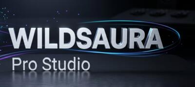

# 🎬 WildSaura Pro Studio

> Cinematic WebP converter optimized for Sony A7R V 61MP files with LUT color grading.



## ✨ Features

- **12 Cinematic LUT Presets** — Midnight Teal, Vintage Soul, Wild Aura Gold, Deep Forest, Kodak 250D, Shadow Whisper, Tungsten Night, Ethereal Mist, B&W Noir, Safari Earth, Nordic Blue, Cinematic Punch
- **Custom .cube LUT support** — Upload your own 3D LUT files
- **Before/After Curtain Slider** — Drag-only handle for smooth comparison
- **Smart WebP Conversion** — Auto-optimizes quality to reduce file size, falls back to JPEG if needed
- **Batch Processing** — Convert multiple images at once
- **Zip Download** — Download all converted files as a zip archive
- **4K Resize Option** — Resize large images to 3840px max width
- **EXIF Data Control** — Preserve or remove camera metadata
- **Smart Naming** — Auto-rename files like `OriginalName_WildSaura_MidnightTeal.webp`
- **Mobile-First Design** — Optimized for phone screens with iOS 26 Liquid Glass theme
- **Dark Premium UI** — Instagram-inspired clean interface

## 🖼️ Supported Formats

- JPEG, PNG, TIFF, WebP, BMP
- Up to 61MP (Sony A7R V full resolution)
- Auto-resizes images >8000px during loading to prevent browser crashes

## 🛠️ Tech Stack

- React 19 + TypeScript
- Canvas API for image processing
- Lucide React icons
- JSZip for batch zip downloads
- Pure CSS with iOS 26 Liquid Glass design system

## 📱 Mobile Optimized

- Fixed bottom action bar with safe-area support
- Touch-friendly controls
- Compact header with brand identity
- Horizontal scrollable filter strip (Instagram-style)

## 🚀 Getting Started

1. Open `index.html` in a browser
2. Upload photos (tap or drag & drop)
3. Select a LUT filter preset
4. Adjust quality and settings
5. Tap "Convert to WebP"
6. Download individual files or zip

## 📂 Project Structure

```
wildsaura-studio/
├── app.tsx              # Main application component
├── types.ts             # TypeScript interfaces
├── styles.css           # iOS 26 Liquid Glass theme
├── index.html           # Entry point
├── package.json         # Dependencies
├── components/
│   ├── DropZone.tsx     # File upload drag & drop
│   ├── LUTPanel.tsx     # LUT filter selection strip
│   ├── ImagePreview.tsx # Before/After curtain slider
│   ├── FileList.tsx     # File cards with size comparison
│   └── ConversionSettings.tsx
├── utils/
│   ├── imageProcessor.ts # Canvas-based image processing
│   └── lutData.ts       # 12 LUT presets + .cube parser
└── assets/
    ├── logo-icon.png    # Brand icon
    ├── logo-w-icon.jpg  # Circular header logo
    ├── logo-banner.jpg  # Background banner
    └── logo-banner-text.jpg # Text banner
```

## 📄 License

MIT

---

Built with 💜 by **WildSaura**
